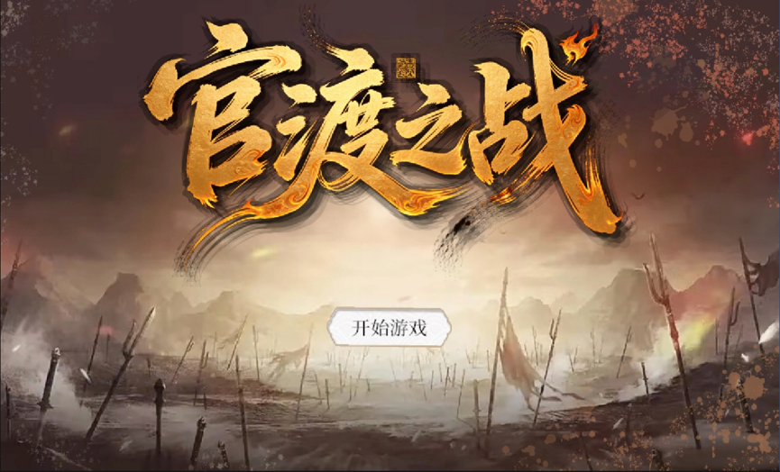
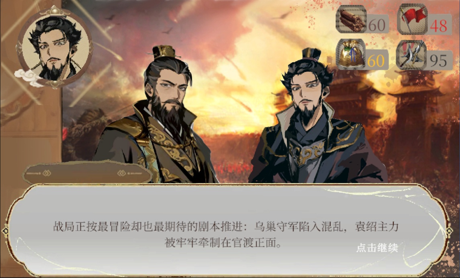
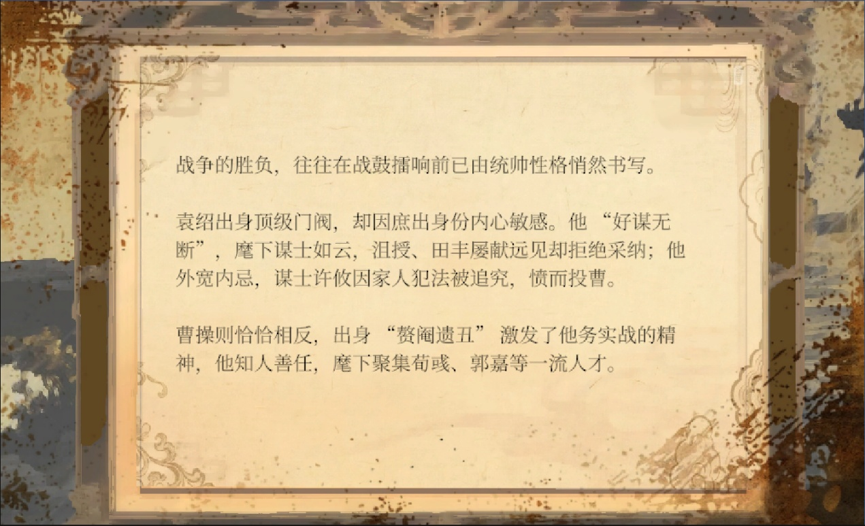
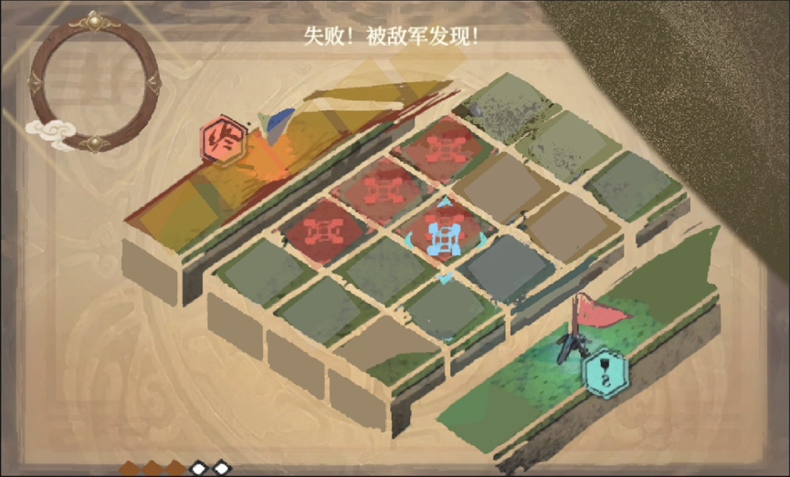
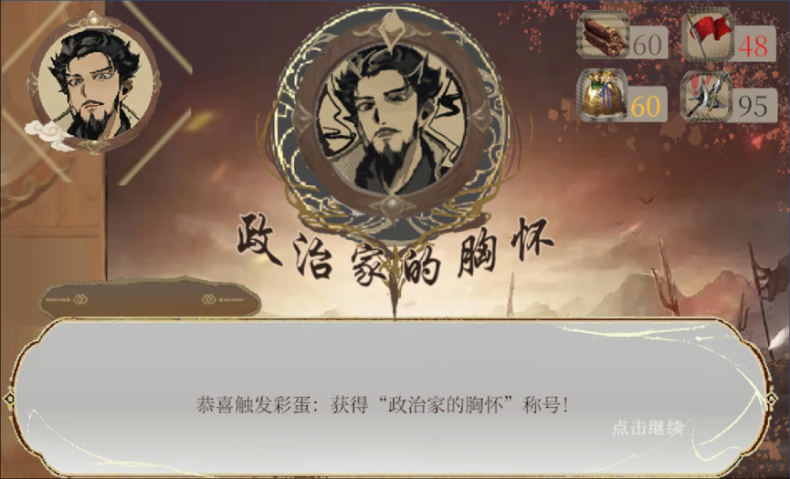
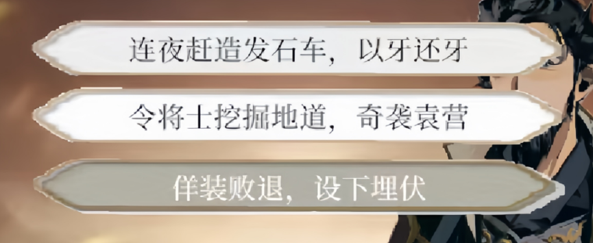
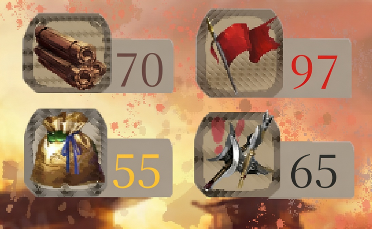
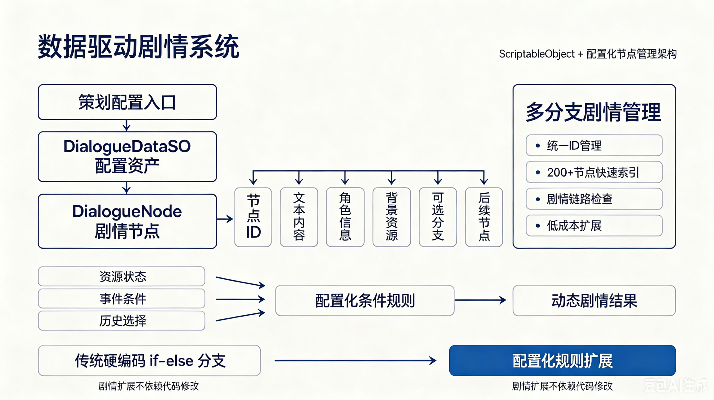

# 三国·官渡之战 | Three Kingdoms: Battle of Guandu

<p align="center">
  
  
  
  
</p>

---

# 项目简介

**《三国·官渡之战》** 是一款基于 Unity 开发的历史剧情策略游戏。

项目核心并非单纯复现历史剧情，而是探索：

> 如何通过数据驱动架构，实现复杂非线性剧情、动态资源约束与多结局决策系统。

玩家将在官渡之战背景下扮演曹操，通过战略选择影响：

- 兵力
- 粮草
- 计策成功率
- 风险值

系统根据玩家决策动态计算剧情走向，最终产生 **7种不同结局**。


项目重点解决以下问题：

- 多分支剧情如何避免大量 if-else 嵌套；
- 数百个剧情节点如何保持可维护性；
- 多维资源如何影响事件结果；
- 游戏逻辑如何实现配置化扩展。

---

# 游戏展示



## 剧情交互界面












## 资源决策系统




## 多结局展示


---

# 游戏特性

## 非线性剧情系统

- 200+剧情节点
- 7种结局路线
  - 1条历史胜利路线
  - 6条架空历史路线

玩家不同选择会改变：

- 资源状态
- 后续剧情
- 最终结局

---

## 动态决策系统

设计四维资源模型：

|资源|作用|
|-|-|
|兵力|影响战斗结果|
|粮草|影响持续作战能力|
|计策|影响策略成功概率|
|风险|影响失败概率|


通过资源组合动态决定事件结果，实现：


---

# 技术架构



## 1. 数据驱动剧情系统

针对传统剧情游戏中大量硬编码导致维护困难的问题，采用：

**ScriptableObject + 配置化节点管理架构**

实现：

- 剧情文本数据与代码解耦；
- 节点、选项、条件独立配置；
- 支持策划人员无需修改代码调整剧情。


核心数据结构：

```text
DialogueDataSO
 ├── DialogueNode
 │    ├── DialogueOption
 │    ├── ResourceEffect
 │    └── Condition
```

每个剧情节点包含：

- 节点ID
- 文本内容
- 角色信息
- 背景资源
- 可选分支
- 资源变化
- 后续节点


---

## 2. 多分支剧情管理系统

通过统一ID管理：

- 支持200+节点快速索引；
- 避免剧情断链；
- 降低后期扩展成本。


---

## 3. 动态决策算法

设计基于资源阈值的条件判断机制。

相比传统：

```csharp
if(resource > x)
{
    ...
}
else
{
    ...
}
```

采用配置化条件规则：

资源状态+事件条件+历史选择 -> 动态剧情结果

同时通过配置化规则替代了传统硬编码分支逻辑，使剧情扩展不依赖代码修改。

---

# 核心模块

## Dialogue System

负责完整剧情运行流程：

- 节点加载与缓存；
- 剧情节点跳转；
- 玩家选项处理；
- 条件判断与分支触发。

---

## Resource System

管理核心策略资源：

- 兵力（Troops）
- 粮草（Supplies）
- 计策（Strategy）
- 风险（Risk）


支持：

- 资源数值动态变化；
- 状态监听与事件广播；
- UI实时同步。


---

## Mini Game System

包含多个独立交互模块：

- 拼图解谜（Puzzle）
- 网格移动（Grid）
- 挖地道（Tunnel）
- 滑块策略（Slider）


小游戏结果会影响：

- 后续剧情节点；
- 资源状态变化；
- 最终结局判定。


---

## Audio & UI System

负责游戏表现层管理：

- 动态 BGM 切换；
- 音效播放与管理；
- UI状态控制；
- TextMeshPro 字体适配与文本渲染优化。

---

# 技术栈

| 类别 | 技术 |
|---------|------|
| 游戏引擎 | Unity 2022.3.6f1 LTS |
| 语言 | C# |
| 架构 | Data-driven Architecture |
| 数据系统 | ScriptableObject |
| UI | UGUI + TextMeshPro |
| 版本管理 | Git/GitHub |

---

# 快速开始

git clone https://github.com/Onesummer-D/ThreeKingdoms-Guandu.git

使用 Unity Hub 打开项目：

Unity Version:
2022.3.6f1 LTS

---

## 开源协议

MIT License
