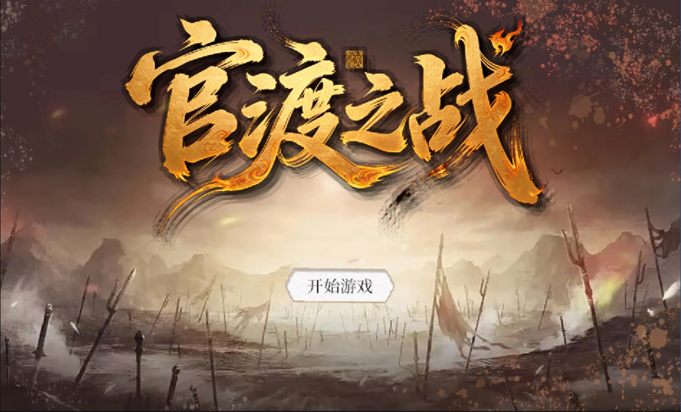
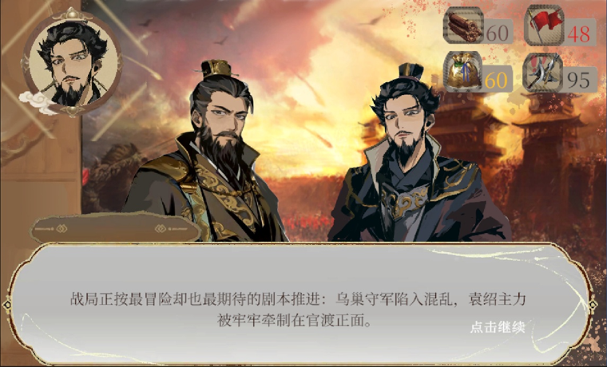
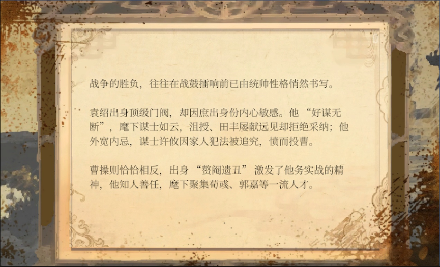
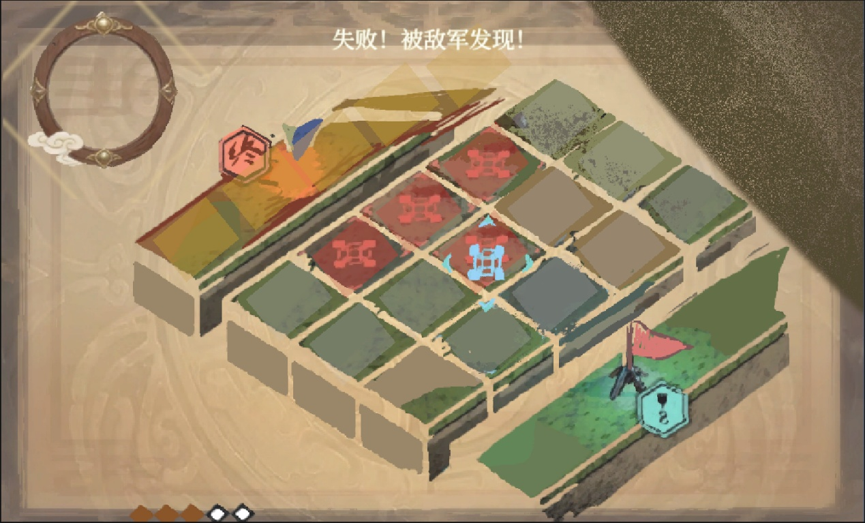
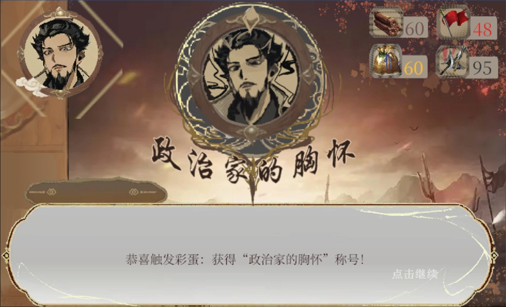
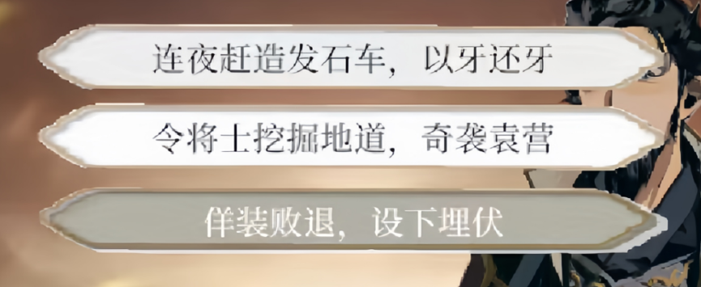
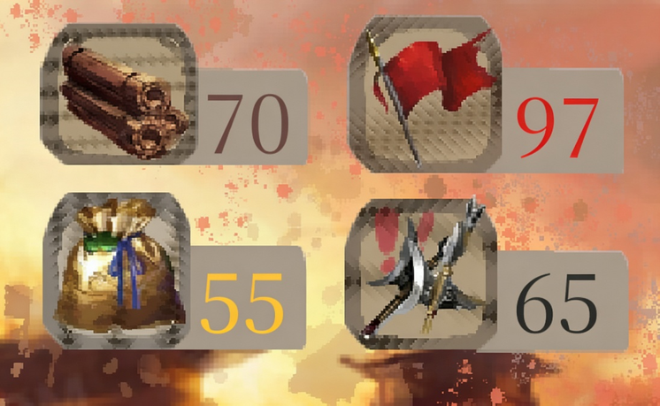

# 《三国·官渡之战》

**2D 剧情解谜冒险游戏** · **Three Kingdoms: Battle of Guandu**

<p align="center">
  
  
  
  
</p>

## 作品概览

《三国·官渡之战》把官渡之战中的关键抉择整理成一段可以亲自参与的短篇战役。玩家以曹操视角推进五幕剧情，在兵力、粮草、计策与风险之间做判断。每次选择都会改变资源状态、后续节点和终局评价，单局流程约十至十五分钟，适合完整体验后再次尝试另一条路线。

作品关注一个很具体的问题。历史人物面对信息不完整、资源有限和时间压力时，选择是怎样一步步变成结果的。游戏中的史实节点、历史说明和架空分支会明确区分，玩家可以在故事里做决定，也能在战绩报告和剧情回顾中回看决定造成的影响。

## 试玩时可以看到什么

### 选择会留下痕迹

四项资源贯穿剧情。

| 资源 | 在游戏中的作用 |
| --- | --- |
| 兵力 | 影响正面作战与守备能力 |
| 粮草 | 影响持续作战和后续行动空间 |
| 计策 | 影响策略行动的成功可能 |
| 风险 | 记录局势失控和决策失误带来的压力 |

资源变化会即时显示。玩家可以根据当前状态调整策略，系统也会把关键变化写入运行记录。

### 小游戏与剧情互相影响

剧情节点中穿插拼图、网格移动、挖地道和滑块策略等轻量交互。小游戏结果会影响资源与后续剧情，解谜过程和叙事结果保持在同一条因果线上。

### 七种结局与一条彩蛋链

游戏提供七条终局分支，其中包含一条历史走向和六条架空分支。每个结局都有独立评价、文化边界说明和回顾内容。部分节点还隐藏了连续触发的彩蛋，鼓励玩家在完成一局后继续探索。

### 一套围绕复盘设计的功能

- 史官注为关键历史节点补充背景与史实边界
- 人物介绍和玩法介绍帮助玩家快速进入情境
- 剧情回顾按幕整理已解锁内容，并使用不同场景卡片呈现
- 本地存档、自动检查点和通关记录支持中途退出与再次游玩
- 战绩报告展示决策次数、资源状态、结局评价和资源可视化
- 本地 PNG 海报把一局结果保存为可分享的战报
- 决策点可发起离线“军议邀约”，填写昵称、选择建议并提交理由
- 参谋建议只作为辅助信息，不会代替主玩家推进剧情

军议邀约是本地单机接力功能，不依赖账号、后端或网络服务。玩家始终保留最终选择权。

## 游戏展示

### 首页与进入游戏



### 剧情交互











### 资源决策



### 多结局


## 技术实现

### 数据驱动的剧情结构

剧情文本、角色、背景、选项、条件、资源效果和后续节点保存在 ScriptableObject 数据中。运行时通过节点 ID 建立索引并处理跳转，内容调整和逻辑代码保持分离。

```text
DialogueDataSO
 └── DialogueNode
      ├── DialogueOption
      ├── ResourceEffect
      ├── Condition
      └── NextNode
```

统一的节点与选项结构用于维护多分支剧情，资源条件和历史选择共同参与结果计算，减少分支断链和重复逻辑。

### 主要模块

- Dialogue System 负责节点加载、选项处理、条件判断和分支跳转
- Resource System 负责四项资源、变化事件和 UI 同步
- Mini Game System 提供拼图、网格、地道和滑块交互
- Save and History System 负责存档、检查点、通关记录和剧情回顾
- Battle Report System 汇总决策、资源、结局评价和分享海报
- Advisor System 管理军议邀约、建议审核与共谋回声
- Audio and UI System 管理 BGM、音效、界面状态和 TextMeshPro 渲染

### 技术栈

| 类别 | 技术 |
| --- | --- |
| 游戏引擎 | Unity 2022.3.62f3c1 LTS |
| 语言 | C# |
| 数据系统 | ScriptableObject |
| UI | UGUI、TextMeshPro |
| 运行平台 | Windows 10/11 64 位 |
| 版本管理 | Git / GitHub |

## 项目结构

```text
Assets/
├── Scenes/Guanduuuu.unity       主场景
├── Scripts/Data/                剧情数据与配置
├── Scripts/Managers/            游戏流程与状态管理
├── Scripts/UI/                  页面与交互界面
└── Art/                         场景、角色、按钮和图标资源
Documentation/                   阶段记录、授权台账与 QA 检查
README_Assets/                   README 展示图片
```

## 开始开发

使用 Unity Hub 以 **Unity 2022.3.62f3c1 LTS** 打开仓库，等待资源导入完成后运行 `Assets/Scenes/Guanduuuu.unity`。

```bash
git clone https://github.com/Onesummer-D/ThreeKingdoms-Guandu.git
```

Windows 构建需要保留 Unity 导出的 exe、同名 `_Data` 文件夹、`MonoBleedingEdge`、`UnityPlayer.dll` 和 `UnityCrashHandler64.exe`。当前仓库以工程源码为主，构建与投稿材料按比赛提交包单独整理。

## 验收与资料

阶段四的自动化检查覆盖存档、主页与设置、运行历史、战绩报告、军议邀约循环，以及章节和结局链路。4D 静态覆盖检查确认了五个关键历史锚点、七条终局分支、彩蛋链路和史实与架空边界。

详细记录见以下文件。

- [`Documentation/阶段四验收总结.md`](./Documentation/阶段四验收总结.md)
- [`Documentation/阶段四开发记录.md`](./Documentation/阶段四开发记录.md)
- [`Documentation/阶段四4D文化核对表.md`](./Documentation/阶段四4D文化核对表.md)
- [`Documentation/QA/阶段四4D全流程回归清单.md`](./Documentation/QA/阶段四4D全流程回归清单.md)
- [`Documentation/素材授权台账.md`](./Documentation/素材授权台账.md)

当前版本定位为单机 Windows 作品，远程联机、手机端和跨设备服务不在本次构建范围内。

## 开源协议

MIT License
